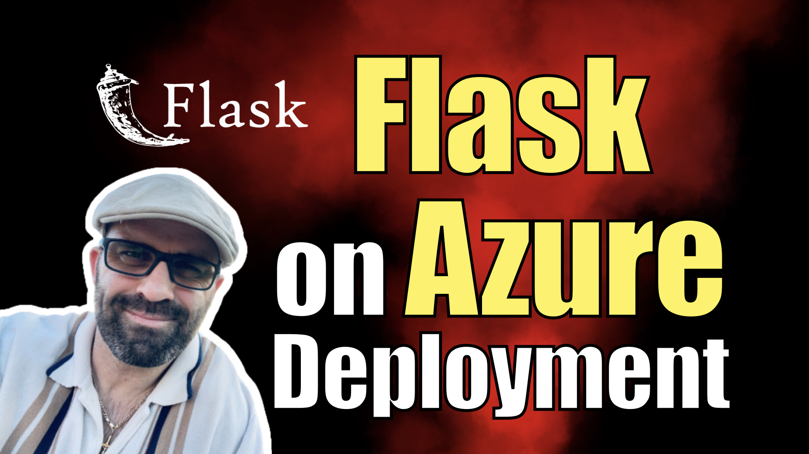

## Flask on Azure Deployment

I have a step by step walkthrough for this project on my [my blog](https://kalbartal.net/flask-on-azure-deployment/).

This is a simple Flask web application that demonstrates how to deploy a Flask app to Azure App Service using Git.

Getting Started

To get started with this app, you will need to have an Azure account and an App Service plan set up. You will also need to have Git installed on your local machine and have a Git repository set up for the app.

To deploy the app to Azure, follow these steps:

1. Clone the Git repository for the app to your local machine.
2. Set up deployment credentials for the app in the Azure portal.
3. Use Git to push the app to Azure App Service.
4. Verify that the app is running correctly on Azure.

For more detailed instructions, see the [deployment tutorial](https://kalbartal.net/flask-on-azure-deployment/).

App Structure

The app consists of a single Python file, `app.py`, that defines a simple Flask app. The app displays a "Hello, World!" message on the home page and a "About" page with some basic information about the app.

Dependencies

The app has the following dependencies:

- Flask
- gunicorn

These dependencies are listed in the `requirements.txt` file, which is used by Azure App Service to install the necessary packages.

License

This app is licensed under the MIT license. See the `LICENSE` file for more details.

Contributing

If you would like to contribute to this app, feel free to submit a pull request.